# Hi there! I'm Evgeniy 👋

### 🛠 Focus & Expertise
I am a software developer focused on **open-source contribution**, architectural research, and collaborative development. 

---

### 🚀 Looking for my personal projects?
To maintain a clean workflow, I host my original source code, pet projects, and architectural experiments on my primary development account:

👉 **[github.com/evyex](https://github.com/evyex)** — **Main Dev Profile**

Visit the link above to see my latest builds, library contributions, and experimental repositories.

---

### 📊 Activity on this account (evgenij-vy)
This profile serves as my **collaboration hub**, where I focus on:
* **Code Reviews** and deep-diving into complex codebases.
* **Upstream Contributions** (bug fixes and feature requests).
* **Forking & Researching** tools to adapt them for specific workflows.

---

### 📫 Let's Connect
* **Primary Dev Profile:** [evyex](https://github.com/evyex)
* **Telegram:** [@Evgenij_vy](https://t.me/Evgenij_vy)
* **LinkedIn:** [linkedin.com/in/evgenijvy/](https://www.linkedin.com/in/evgenijvy/)

---
*"Good code is not just about what you write, but how you improve what is already there."*
